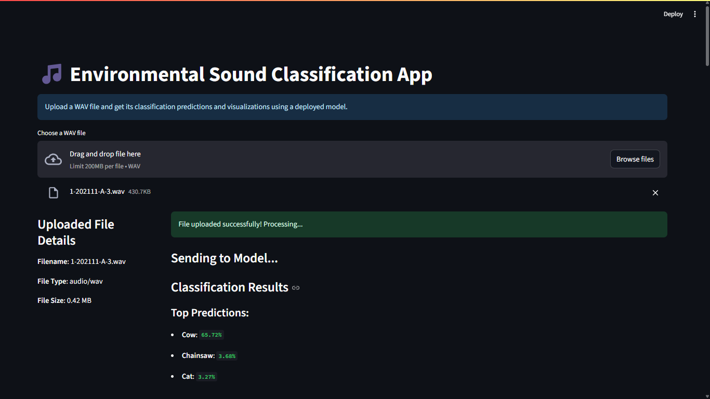

## Environmental Sound Classification

App link: https://environmental-sound-classification-mpznmnctvxkzjgvfqdipyd.streamlit.app/
Note: file must be wav and it must no be more than 10mb

This project demonstrates an end-to-end solution for classifying audio signals using Convolutional Neural Networks (CNNs). The core idea involves converting audio into spectrograms, training a CNN on these visual representations, deploying the model for inference using Modal, and providing a user-friendly web interface with Gradio.

### Features
- Spectrogram Conversion: Transforms raw audio waveforms into visual spectrograms, which CNNs can effectively process.

- CNN Model Training: Implements and trains a Convolutional Neural Network for robust audio classification.

- Modal for Inference: Leverages Modal for efficient, scalable, and serverless deployment of the trained model for inference.

- Streamlit: Provides an intuitive web interface for users to upload audio files and receive real-time classification predictions.

- End-to-End Pipeline: Demonstrates a complete workflow from data preprocessing to model deployment and interactive demonstration.

### Technologies Used
- Python: The primary programming language for the project.

- PyTorch: For building and training the CNN model.

- Librosa, Torchaudio: For audio loading, preprocessing, and spectrogram generation.

- NumPy: For data manipulation.

- Modal: For serverless function deployment and model serving.

- Streamlit: For creating the interactive web dashboard.

- Tensorboard: For visualizing training.
